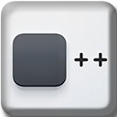

# Blank++ | ☐++

[//]: # (**The Quantum Leap in Browser Innovation**)



## Welcome to the Future of Browser Tabs 🚀

Introducing **Blank++**, the ultimate solution to your Chromium tab woes. In a world filled with clutter, chaos, and waste, we bring you the pinnacle of digital minimalism – a **completely blank** new tab page.

---

### 🔥 **Why Blank++?** 🔥

In a world tangled with distractions, Blank++ stands as a beacon of minimalism. We understand that sometimes, less is more—much, much more. Our team of highly trained professionals, product teams, and advanced Artificial Intelligence have worked tirelessly to bring you the pinnacle of blank technology.

---

## 🌟 *Features* 🌟

- **🌱 Eco-Mode Engaged**: By literally doing nothing, <font style="text-shadow: #fafafa 1px 0 10px;" >Blank++</font> conserves both memory and processing power, ensuring your device maintains peak performance.
- **🔒 Perfect Privacy**: Nothing to display, no data collected. Your privacy is our top priority, and <font style="text-shadow: #fafafa 1px 0 10px;" >Blank++</font> guarantees it.
- **🧘‍♂️ Zero Configuration**: No settings, no options—we've taken the liberty of not giving you any choices. Like Henry Ford said, "Any color as long as it’s black."
- **🌌 Groundbreaking Blankness**: With <font style="text-shadow: #fafafa 1px 0 10px;" >☐++</font>, your new tab is not just *blank* – it's **Blank Plus Plus!** Experience the revolutionary emptiness that can only be achieved through cutting-edge algorithms and rigorous testing.
- **⏱️ 24/7 Uptime**: <font style="text-shadow: #fafafa 1px 0 10px;" >Blank++</font> is always there for you, doing nothing, all day every day. #AlwaysOn #FiveNines #BaaS
- **🏋️‍♂️ Fully Optimized**: We've rigorously tested <font style="text-shadow: #fafafa 1px 0 10px;" >Blank++</font> in countless scenarios, ensuring that it does nothing in every possible situation.
- **👶 User-Friendly Interface**: The simplicity means you won't even notice it's there. Because it isn't.

## 📈 **Performance Benchmarks**

We’ve conducted extensive testing to ensure Blank++™️ remains the gold standard in doing absolutely nothing.
- **💻 Zero-Resource Consumption**: Our engineering marvels have achieved the unthinkable—a software that uses no CPU*, no RAM*, and almost no disk space. Welcome to the future of efficiency.
- **🚀 Zero-Load Technology**: <font style="text-shadow: #fafafa 1px 0 10px;" >Blank++</font> boasts an unparalleled load time of 0 milliseconds*. Yes, you read that correctly—**zero**. So fast it's almost like it's not doing anything at all.

---

### 📲 Installation
 You can download the latest release on the [Releases Page](https://github.com/kjerk/blankplusplus-chrome/releases), or can simply go to the Chrome Store to install Blank++.

### 📲 Manual Installation
1. Clone the repository:
   ```bash
   git clone https://github.com/kjerk/blankplusplus-chrome.git
   ```
2. Navigate to the project directory:
   ```bash
   cd blankplusplus-chrome
   ```
3. Load the extension in Chrome:
	- Open Chrome and go to `chrome://extensions/`
	- Enable "Developer mode"
	- Click "Load unpacked" and select the `bpp_extension/` subdirectory.

---

## 🧠 Usage

1. **Open** your browser.
2. **Look** at the blank page.
3. **Feel** the emptiness.
4. **Repeat** as necessary.

### 👀 Demonstration

<a href="_assets/bpp_demo.mp4"></a>

## 🤝 Contributing

Interested in contributing? Awesome! You can't. This project is perfect. But feel free to fork it and tinker around. Can't improve on perfection.

## 📈 **The Science Behind Blank++**

Our team of 10x Engineers and Prompt Scientists have meticulously analyzed the psychological impact of a featureless, distraction-free environment over a grueling series of charrettes. Through extensive research and endless hours of doing nothing, we've discovered that Blank++ improves cognitive performance by an astounding 0.000000001%. That's not even a rounding error—that's precision engineering at its finest!


## 🧪 **Testimonials**

> “Wow, this is truly unremarkable. I’ve never seen anything so empty.” - Anonymous User, Probably Fake

> “Blank++ transcends the trivial trappings of modern software. It’s like the void staring back at you.” - AI that pretends to understand poetry

> "I'm sorry, I do not have knowledge that extends beyond 2023." - ChatGPT, when asked about Blank++

> "Why are you standing around outside my house?" - Martin Fowler

> "The future of venture capitalism is in doing nothing. That's why I’m all in on Blank++." - Silicon Valley Overachiever, Definitely Fake


## 🗣 Issues

If you encounter any issues or bugs, please report them to our dedicated blank support team. We won't read them, because why fix what's already perfect? But feel free to vent.

* As an environmental measure, we've decided to save resources by not responding to any queries. Our planet thanks you.

---

### 🔒 **Security and compliance**

Are you the CISO of a company that craves a checklist to ease those existential dreads? See our *[Security Document](SECURITY.md).*

### 💰 **Funding**

Did the mere whisper of 'Artificial Intelligence' set your investor appetite ablaze and loosen your wallet? Dive into our [Funding Document](FUNDING.md), where you'll discover that the true treasury of Blank++ lies in its sublime emptiness. No currency, just serenity—buy high, sell never.

---

## License
BlankPlusPlus is licensed under the GPLv3 License. For more information, see the [LICENSE](LICENSE) file within this repository, or just ask a language model.

---

## 🙏 Acknowledgements

We'd like to thank everyone who helped make Blank++ the magnificent piece of art it is.

- **Our AI Overlords**: For relentlessly optimizing and testing to ensure Blank++ does nothing better than anything else possibly could.
- **The Blank Foundation**: For their unwavering support and strategic partnership.
- **You**: For believing in the power of doing nothing and making Blank++ an essential part of your daily routine.

---

May your blankness be pure and your browsing experience as empty as it is vast.

Cheers! 🍻 ~*The Blank++ Team*


<sub><sub>* Claims not validated.</sub></sub>
